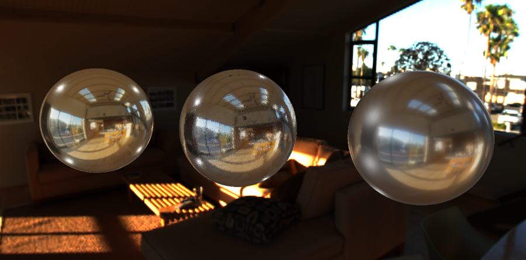
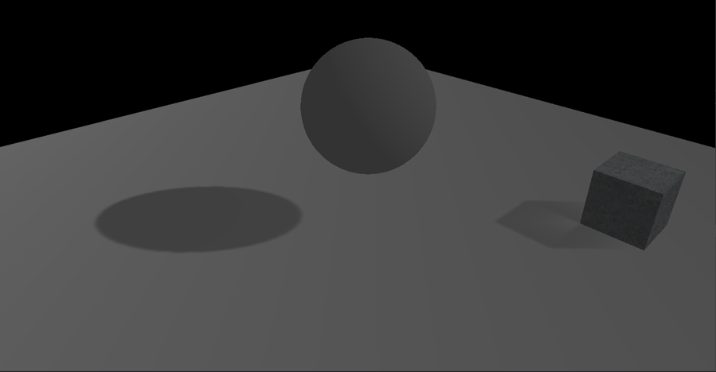

# Titan 
3D Real-Time Engine

## Features
* Deferred Shading
* Clustered Forward Shading
* Physically Based Rendering
* BRDF Lighting
* Image Based Lighting
* Shadow Mapping
* Ambient Occlusion
* Particle System
* Bloom
* Depth of Field

## Screen Shots





## Prerequisites
* Windows10 (x64 version)
* Visual Studio 2019 (any edition)
* Relatively recent version of Windows 10 SDK

## How to build
To generate project files, run the ```GenerateProjects.bat```, can be found at root folder. All thirdparty stuffs will set up automatically. 